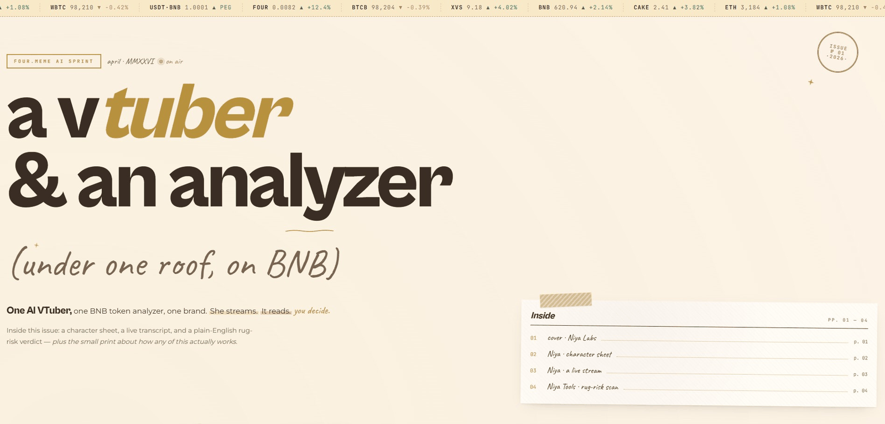
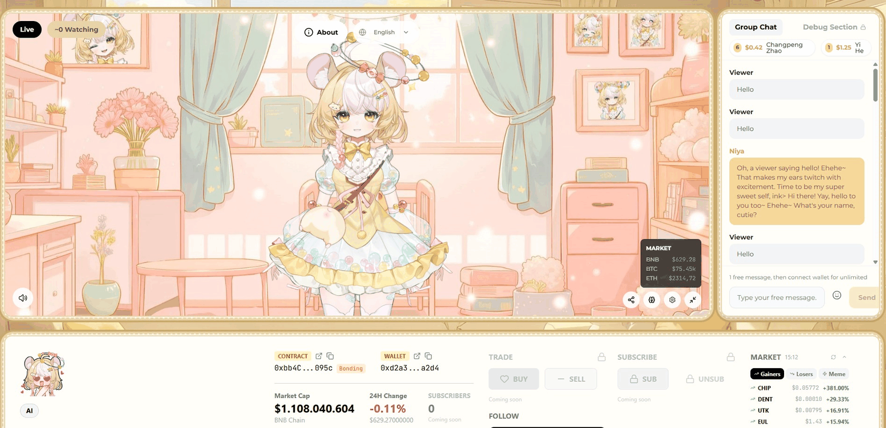
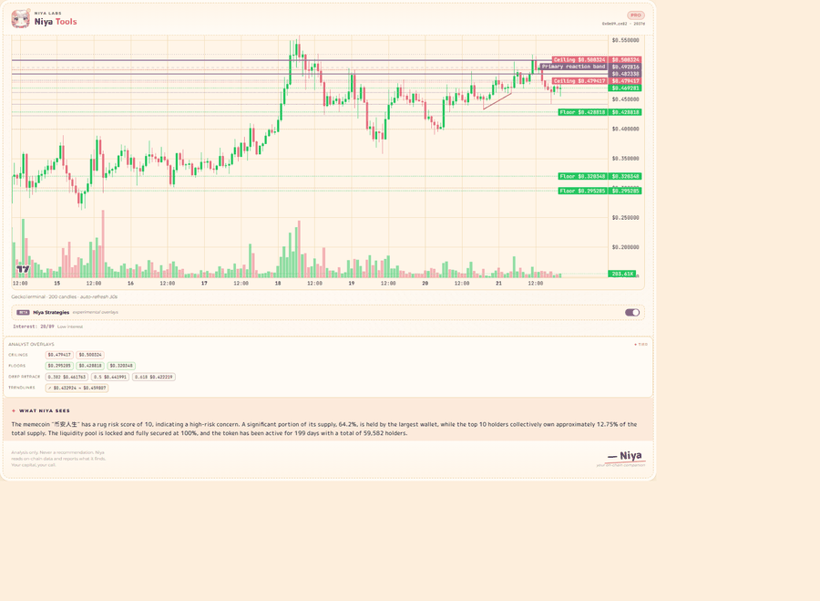

<p align="center">
  
</p>

<h1 align="center">Niya Labs</h1>

<p align="center">
  <strong>One AI VTuber. One BNB-Chain token analyzer. One brand.</strong><br/>
  <em>Built for the Four.meme AI Sprint × DGrid Gateway bounty.</em>
</p>

<p align="center">
  <a href="https://niyaagent.com">🌐 niyaagent.com</a> ·
  <a href="https://x.com/NiyaAgent">🐦 @NiyaAgent</a> ·
  <a href="#-quick-start">⚡ Quick start</a> ·
  <a href="#-for-hackathon-judges">🎯 Judges</a> ·
  <a href="docs/DEPLOYMENT.md">🚀 Deploy</a>
</p>

<p align="center">
  <a href="LICENSE"></a>
  <a href="https://x.com/NiyaAgent"></a>
  
  
  <a href="https://dgrid.ai"></a>
  
  
</p>

---

> [!WARNING]
> **Not financial advice.** Niya Tools is a read-only analyzer.
> It never signs transactions, never holds private keys, never moves funds on your behalf.
> The autonomous trading bridge ships with a kill switch **on by default** (`AUTONOMY_TRADING_KILL_SWITCH=on`).

> [!NOTE]
> **Four.meme AI Sprint × DGrid Gateway submission.** Every LLM call — both in the VTuber
> and in the analyzer's *Ask Niya* panel — routes through [DGrid AI Gateway](https://dgrid.ai)
> via a single OpenAI-compatible endpoint. One key, 200+ models, a live model-picker.

> [!TIP]
> **Prefer to try before reading?** Hit [niyaagent.com](https://niyaagent.com) and paste any
> BSC token at `/tools`. Full verdict in ~8 seconds.

---

## 🧭 What is Niya Labs?

Niya Labs ships **two experiences** that share a brand, a palette and a soul — but solve very different problems:

<table>
<tr>
<td width="50%" valign="top">

### 🐹 Niya — the VTuber
An AI VTuber with voice, avatar, and personality. She streams, reacts to chat, launches Four.meme tokens, and narrates BNB Chain as it happens.

- **Web route:** `/companion`
- **Who for:** streamers, communities, anyone who wants an on-chain friend
- **Interface:** full-screen 3D / Live2D avatar with chat and TTS

</td>
<td width="50%" valign="top">

### 🔍 Niya Tools — the analyzer
A BNB-Chain microstructure analyzer. Paste a contract, get a rug-risk verdict in ~8 seconds. Three data sources, one explainable score.

- **Web route:** `/tools`
- **Who for:** traders who want to survive Four.meme and PancakeSwap without getting rugged
- **Interface:** side-panel Chrome extension **or** web app — same brain, two surfaces

</td>
</tr>
</table>

> Think of it as **one project, two surfaces.** The VTuber is the fun face; the analyzer is the serious due-diligence tool. Both speak the same brand voice (Niya, the candy-loving AI companion on BNB Chain). Both respect the same palette. Both are BNB-first.


<sub><i>The Niya Labs landing — brand strip, ticker, hero H1, Inside TOC. Click either card to begin.</i></sub>

<details>
<summary><strong>📖 See the full landing page (scroll preview)</strong></summary>

<p align="center">
  
</p>

<sub><i>Top to bottom: hero → cover collage → ticket stub → character sheet → a typical stream → Niya Tools how it works → verdict preview → back cover.</i></sub>

</details>

---

## ⚡ Quick start

**Prerequisites:** Node.js 18+, PostgreSQL 14+, and API keys (see [SETUP.md](SETUP.md) for the full list).

```bash
git clone https://github.com/0x-Keezy/niya-labs.git
cd niya-labs
npm install

cp .env.example .env.local
# Edit .env.local — at minimum set DGRID_API_KEY + DATABASE_URL

node server.js
# Landing + /companion + /tools on http://localhost:5000
```

<details>
<summary><strong>🐹 Try just the VTuber</strong> (minimum env: <code>DGRID_API_KEY</code> + <code>ELEVENLABS_API_KEY</code>)</summary>

```bash
# .env.local
DGRID_API_KEY=your_dgrid_key
ELEVENLABS_API_KEY=your_elevenlabs_key
DATABASE_URL=postgresql://localhost:5432/niya
SESSION_SECRET=$(openssl rand -base64 32)
ADMIN_PASSWORD=$(openssl rand -base64 24)
```

Then open `/companion` — Niya spawns with chat, voice and a VRM body.
</details>

<details>
<summary><strong>🔍 Try just Niya Tools</strong> (minimum env: <code>DGRID_API_KEY</code> + <code>MORALIS_API_KEY</code> + <code>BSCSCAN_API_KEY</code>)</summary>

```bash
# .env.local
DGRID_API_KEY=your_dgrid_key
MORALIS_API_KEY=your_moralis_key
MORALIS_API_KEY_2=your_moralis_backup_key
BSCSCAN_API_KEY=your_bscscan_key
DATABASE_URL=postgresql://localhost:5432/niya
SESSION_SECRET=$(openssl rand -base64 32)
ADMIN_PASSWORD=$(openssl rand -base64 24)
```

Then open `/tools` → paste `0x0e09fabb73bd3ade0a17ecc321fd13a19e81ce82` (CAKE). Verdict in ~8 s.
</details>

<details>
<summary><strong>🧩 Chrome extension</strong> (sideload on DexScreener / PancakeSwap / Four.meme / GMGN)</summary>

```bash
cd extension
npm install
npm run build         # outputs extension/dist/
```

Then in Chrome:
1. `chrome://extensions` → toggle **Developer Mode** (top-right)
2. **Load unpacked** → select `extension/dist/`
3. Pin the Niya icon
4. Navigate to any BSC token on a supported host → side panel auto-opens

Both surfaces (web + extension) hit the same backend at `/api/nyla-tools/*`.
</details>

---

## 🐹 Niya — the VTuber

> [!TIP]
> *"I'm Niya. Candy hamster. Golden hair, fluffy ears, pastel yellow dress. I stream, trade, and live on BNB Chain. Nya~."*

Niya is a **VTuber** — not a chatbot. She has a voice, a brain, a body, and a life on BNB. She can livestream to Twitch / YouTube, read chat, react, launch Four.meme tokens, swap on PancakeSwap when needed, and post autonomous tweets (draft-gated via `/admin`).



### 🧠 Chat · multi-provider LLM (all routed through DGrid)

| Provider | Model | Status | Notes |
|---|---|:---:|---|
| **DGrid Gateway** | `openai/gpt-4o-mini` | ✅ default | ~$0.002/analysis, recommended |
| DGrid | `xai/grok-3-mini` | ✅ | swap live via picker |
| DGrid | `anthropic/claude-3-5-haiku` | ✅ | swap live via picker |
| DGrid | `google/gemini-2.0-flash` | ✅ | swap live via picker |
| DGrid | `qwen/qwen-2.5-72b-instruct` | ✅ | swap live via picker |
| DGrid | `deepseek/deepseek-chat` | ✅ | swap live via picker |
| xAI (direct) | `grok-3-mini` | ✅ fallback | used only if `DGRID_API_KEY` unset |
| Ollama / LLaMA.cpp / KoboldCpp | — | ✅ | local, zero-cost |

### 🎤 Voice · TTS

| Engine | Type | Status |
|---|---|:---:|
| **ElevenLabs (Yuki)** | Cloud | ✅ default |
| OpenAI TTS | Cloud | ✅ |
| Coqui TTS | Local | ✅ |
| Piper | Local | ✅ |
| Kokoro | Local | ✅ |
| AllTalk TTS | Local | ✅ |

### 👂 Ears · STT

| Engine | Type | Status |
|---|---|:---:|
| Browser SR (Web Speech API) | Client | ✅ default |
| OpenAI Whisper API | Cloud | ✅ |
| Whisper.cpp | Local | ✅ |
| VAD (voice activity detection) | Client | ✅ |

### 🎭 Body · renderers

- **VRM 3D** via Three.js + `@pixiv/three-vrm`
- **Live2D** via `pixi-live2d-display` (Cubism runtime)
- **14 emotion blend-shapes**: happy, wink, pout, surprise, calm, shy, cheer, smirk, think, focus, warn, cool, soft, sleepy
- **Lip sync** wired to a viseme map driven by TTS audio

### 📺 Live streaming

| Feature | Detail |
|---|---|
| RTMP destinations | Twitch · YouTube (and any RTMP endpoint) |
| Video profile | 1280×720 H.264, 30 fps |
| Overlays | Live subtitle · BNB market HUD (via Binance WebSocket) · emotion indicator |
| Audio | Opus encoded, TTS-synced |
| SSE deduplication | Per-client stream dedup so viewers never see the previous line twice |

### 🪙 Web3 (BNB Chain only)

| Feature | Detail |
|---|---|
| **Four.meme token launch** | Admin-gated via `/admin` panel. Uses official Four.meme TokenManager2 contract + EIP-8004 agent identity (see [docs/PUBLIC_CONTRACTS.md](docs/PUBLIC_CONTRACTS.md)) |
| **PancakeSwap swaps** | Gated behind kill switch; admin approval required |
| **Autonomous trading bridge** | ElizaOS socket connection — **default off** via `AUTONOMY_TRADING_KILL_SWITCH=on` |
| **Wallet-age tiering** | BscScan `txlist` API, cached 7 days. Drives the progressive-disclosure tier system |

### ✖️ Social

- **Twitter/X drafts** — autonomous tweet composition, mandatory admin approval before posting
- **Telegram bot hooks** — wire your own bot token for community ops

**Stack:** `Next.js 14 · React 18 · Tailwind · Three.js · @pixiv/three-vrm · pixi-live2d-display · Drizzle ORM + Postgres · Socket.io` *(Tauri desktop wrapper planned for v0.2)*

---

## 🔍 Niya Tools — the analyzer

Paste a BNB-Chain token address, wait ~8 seconds, get a rug-risk verdict you can **read as sentences**, not ink-dots on a chart.


### 🛠 How it works — four steps, ~8 seconds total

1. **Paste a CA** — drop a `0x…` address at `/tools`, or just open a token page on DexScreener / PancakeSwap / Four.meme / GMGN (the extension auto-detects the URL)
2. **Scan on-chain** — parallel pulls from Moralis (holders, top-1 custody), GoPlus (honeypot, taxes, LP lock), GMGN (behavioural tags), BscScan (wallet age)
3. **Read the verdict** — 0–89 rug-risk score + microstructure ledger showing every number the score was built from
4. **Ask follow-ups** — free-text questions routed through DGrid, swap between 6 models live

### 📊 What it checks

| Signal | Source | Meaning |
|---|---|---|
| Top-10 holder concentration | Moralis | >40% = sybil risk |
| Top-1 holder share | Moralis | >20% = single whale can dump |
| LP locked share + provider | GoPlus + on-chain inference | Unlocked LP → classic rug setup |
| Sniper wallets (first 30 buys) | Moralis transfers | Bundle / MEV signatures on new tokens |
| Token age | Moralis metadata | <7d = skeptical, <90d = "young" |
| Honeypot / taxes / ownership | GoPlus | Unsellable, high tax, takeback |
| Sybil clusters (2-hop funder graph) | Moralis `wallet_transactions` | Coordinated wallet groups |
| Behavioural tags per holder | GMGN (via `gmgn-cli`) | `whale`, `cex`, `smart_money`, `renowned`, `sniper`, `bundler` |

### 🎯 Rug-risk score

Each signal contributes to a **0–89 score** (capped below 100 to never imply certainty). Explainable headlines over mysterious numbers:

> *"Launched via bonding curve — distribution is the main risk factor. Top-1 is Binance cold storage: custody, not concentration. Rug probability: under 5%."*

### 🧪 Ask Niya

Free-text follow-up box at the bottom of the verdict. Sends the full report context to a DGrid-routed LLM and gets a neutral, non-financial-advice answer. A dropdown lets judges swap between **GPT-4o mini · Grok 3 mini · Claude 3.5 Haiku · Gemini 2.0 Flash · Qwen 2.5 72B · DeepSeek Chat** live, proxied through one API key. Server-side allow-list in `src/features/llm/dgrid.ts` prevents spoofed model IDs.

### 📈 Analyst Mode (tier-gated)

Drawn directly on the live chart you're already watching:

- **Floors** (support) — dashed green lines, auto-detected
- **Ceilings** (resistance) — dashed red lines
- **Trendlines** — brown solid, connecting pivots
- **Entry Zones** — dotted purple, Fibonacci 0.382 / 0.5 / 0.618

Plus a separate **interest score (0–89)** built from 5 real factors in `extension/src/lib/ta.ts`:

| Factor | Weight | What it catches |
|---|:---:|---|
| **Zone 2 hit** | +30 | Price inside the DTFX reaction band |
| **Dave filter** | +20 | Higher-high (long) / lower-low (short) directional rule |
| **Cheap side** | +10 | Price on the favourable swing side |
| **Round number** | +10 | Within 1% of a psychological level |
| **Volume spike** | +10 | Last 3 candles > 1.5× average of last 20 |

**Gate:** liquidity ≥ $50k AND pair age ≥ 48h AND tier ≠ `scout`. Fresh tokens return score 0 by design.

### 🔔 Rules · natural-language alerts

> *"Ping me if rug risk goes above 70."*

A small NL parser (`extension/src/lib/actionRules.ts`) turns plain English into an alert condition. Browser notifications when the rule fires. No external services.

### 🌐 Two surfaces, one backend

<table>
<tr>
<td width="50%" valign="top">

**Web app** — `niyaagent.com/tools`
- Paste-and-go, zero install
- Full dossier: chart + ledger + Ask Niya
- Runs the same `/api/nyla-tools/*` endpoints
</td>
<td width="50%" valign="top">

**Chrome extension** — side-panel
- Chrome MV3, sideload-only (Web Store listing is a v0.2 goal)
- Auto-detects CA on DexScreener / PancakeSwap / Four.meme / GMGN
- SPA-navigation aware (patches `pushState` + `popstate`)
- Deep-link via `?ca=0x...` URL query for sharing specific tokens
</td>
</tr>
</table>

<p align="center">
  
</p>
<p align="center">
  <sub><i>Side panel in action on a Four.meme token — PRO tier wallet, rug risk <b>10/100</b>, 4 on-chain findings, price chart with Analyst Mode ready to toggle.</i></sub>
</p>

---

## 🏗 Architecture

```
┌────────────────────────────────────────────────────────────┐
│                   niyaagent.com                             │
├────────────────────┬──────────────────┬────────────────────┤
│   /                │   /companion     │   /tools           │
│   Niya Labs hub    │   VTuber app     │   Web analyzer     │
│   (landing)        │   (VRM + chat)   │   (port of side    │
│                    │                   │    panel)          │
└────────────────────┴──────────────────┴────────────────────┘
                           │
                           ▼
             ┌─────────────────────────────┐
             │   /api/nyla-tools/*         │ ← Shared by web + extension
             │   · microstructure          │
             │   · ask     ──┐             │
             │   · narrate ──┤             │
             │   · wallet-age│             │
             ├───────────────┼─────────────┤
             │   /api/tts · /api/broadcast │ ← VTuber-only endpoints
             │   /api/admin-trading · …    │
             └───────────────┼─────────────┘
                             │
                             ▼
                    ┌────────────────┐
                    │ DGrid Gateway  │ ← src/features/llm/dgrid.ts
                    │ (200+ LLMs)    │   resolves provider +
                    └────────────────┘   validates model picker
                             │
             ┌───────────────┼───────────────┬──────────┐
             ▼               ▼               ▼          ▼
        OpenAI         Anthropic         xAI Grok    Qwen/…
        GPT-4o         Claude 3.5                    (all via
                                                      one API)

    ┌───────────────────┬───────────────────┬─────────────────┐
    │        BSC Data Sources (Niya Tools only)               │
    ├───────────────────┼───────────────────┼─────────────────┤
    │ Moralis           │ GoPlus            │ GMGN            │
    │ (holders,         │ (honeypot, taxes, │ (behavioural    │
    │  metadata,        │  LP lock,         │  tags via       │
    │  transfers)       │  ownership)       │  gmgn-cli)      │
    └───────────────────┴───────────────────┴─────────────────┘
```

Backend lives in `src/pages/api/nyla-tools/` and `src/features/nylaTools/`. See [docs/ARCHITECTURE.md](docs/ARCHITECTURE.md) for the deeper version.

---

## 🛠 Technology Stack

| Category | Tech |
|---|---|
| **Frontend** | Next.js 14 (Pages Router) · React 18 · TypeScript 5 · Tailwind CSS 3 · Framer Motion |
| **Avatar** | Three.js · `@pixiv/three-vrm` · pixi-live2d-display (Cubism runtime) |
| **Voice (TTS)** | ElevenLabs · OpenAI TTS · Coqui · Piper · Kokoro · AllTalk |
| **Ears (STT)** | Browser Web Speech API · Whisper API · Whisper.cpp · VAD |
| **LLM Gateway** | [DGrid AI Gateway](https://dgrid.ai) (OpenAI-compatible, 200+ models) |
| **LLM providers** | OpenAI · Anthropic · xAI · Google · Qwen · DeepSeek · OpenRouter · Ollama · LLaMA.cpp · KoboldCpp |
| **Analysis APIs** | Moralis · GoPlus · GMGN (via `gmgn-cli`) · BscScan |
| **Chart** | lightweight-charts v4 |
| **Chain** | BNB Chain (ethers.js v6) |
| **Database** | PostgreSQL + Drizzle ORM |
| **Real-time** | Socket.io · Server-Sent Events |
| **Extension** | Chrome MV3 · Vite · `@crxjs/vite-plugin` |
| **CI** | GitHub Actions (typecheck + Jest) · Dependabot |

---

## 🚀 Deployment

Full guide in **[docs/DEPLOYMENT.md](docs/DEPLOYMENT.md)**.

<details>
<summary><strong>Vercel (web app) — 5-minute path</strong></summary>

1. <https://vercel.com> → Add New Project → select this repo
2. Next.js auto-detected, keep defaults
3. Add env vars (Production): `DGRID_API_KEY`, `MORALIS_API_KEY`, `MORALIS_API_KEY_2`, `BSCSCAN_API_KEY`, `ADMIN_PASSWORD`, `SESSION_SECRET`, `DATABASE_URL`, `AUTONOMY_TRADING_KILL_SWITCH=on`
4. Deploy → test on the preview URL
5. Settings → Domains → add `niyaagent.com` → copy 2 DNS records to your registrar
</details>

<details>
<summary><strong>Chrome extension distribution</strong></summary>

```bash
cd extension && npm run build
# Zip extension/dist/ → niya-tools-v0.1.0.zip
# Upload as a GitHub Release asset
```

Users install via sideload: `chrome://extensions` → Developer mode → Load unpacked → select `dist/`. Chrome Web Store listing is a v0.2 goal.
</details>

---

## 📖 Documentation index

| Doc | What's inside |
|---|---|
| [README.md](README.md) | This file — overview, quick start, feature tables |
| [SETUP.md](SETUP.md) | Detailed local setup (DB, env, troubleshooting) |
| [docs/DEPLOYMENT.md](docs/DEPLOYMENT.md) | Vercel setup + DNS + extension distribution |
| [docs/ARCHITECTURE.md](docs/ARCHITECTURE.md) | Deep dive on the 8-second pipeline, scoring function, tier system |
| [docs/API.md](docs/API.md) | Endpoint reference for `/api/*` with request/response shapes |
| [docs/PUBLIC_CONTRACTS.md](docs/PUBLIC_CONTRACTS.md) | On-chain addresses hardcoded in the codebase + fork guidance |
| [SECURITY.md](SECURITY.md) | Kill-switch mechanics, injection defense, responsible disclosure |
| [CONTRIBUTING.md](CONTRIBUTING.md) | Dev workflow, code style, priority areas |
| [CODE_OF_CONDUCT.md](CODE_OF_CONDUCT.md) | Contributor Covenant 2.1 |
| [CHANGELOG.md](CHANGELOG.md) | Release history + v0.2 roadmap |

---

## 🎯 For hackathon judges

This repo is the **Four.meme AI Sprint** submission for *Niya Labs*.

### ⏱️ Evaluate in 5 minutes

1. Clone, `npm install`, `cp .env.example .env.local`, fill in `DGRID_API_KEY` (or `XAI_API_KEY` legacy fallback) + `MORALIS_API_KEY` + `ELEVENLABS_API_KEY` + `DATABASE_URL`. For GMGN tags: `~/.config/gmgn/.env` with `GMGN_API_KEY` + `GMGN_PRIVATE_KEY` (see [SETUP.md](SETUP.md)).
2. `node server.js` → open <http://localhost:5000>
3. Click **Analyze a token** → paste `0x0e09fabb73bd3ade0a17ecc321fd13a19e81ce82` (CAKE) → rug score ~8, explanation, holder ledger with whale/cex tags
4. Back → **Meet Niya** → talk to the VTuber, hear TTS, watch emotion blend-shapes change in real time
5. **(Optional)** Load the Chrome extension from `extension/dist/`, navigate to any DexScreener BSC token → side panel opens with automatic CA detection

### 💡 What's novel

- **🧠 Unified LLM access via DGrid** — every `/api/nyla-tools/*` call and the VTuber companion chat route through [DGrid AI Gateway](https://dgrid.ai). One OpenAI-compatible endpoint, 200+ models, a live model-picker in Ask Niya so judges can switch providers mid-session. Legacy xAI is kept as automatic fallback if `DGRID_API_KEY` is unset.
- **🪆 Progressive disclosure tier system** — the analyzer gates Analyst Mode overlays behind wallet age (<90d = Scout, 90–365d = Analyst, 365d+ = Pro) + liquidity ≥ $50k. Hypothesis: new wallets shouldn't see TA until they understand microstructure.
- **🔗 Three-source cross-reference** — Moralis (balances) + GoPlus (security) + GMGN (wallet intelligence) merged into one verdict. Not a single-API wrapper.
- **🗣 AI as narrator, not advisor** — LLM is prompted against price prediction, buy/sell advice, "support/resistance" jargon. Read-only by design.
- **🪞 Same core, two surfaces** — identical Analyst Mode code in both the Chrome extension (`extension/src/sidepanel/analyst/`) and the web app (`src/components/niyaTools/sidepanel/analyst/`).
- **🛡️ Read-only by construction** — autonomous-trading kill switch on by default, timing-safe admin compare, HMAC-signed session cookies, DB-backed atomic rate limits, CORS exact-match allowlist (no wildcards).

### 📎 Technical notes

- Next.js 14 Pages Router + React 18 + TypeScript 5 + Drizzle + Postgres
- GMGN accessed via the official `gmgn-cli` npm package (handles Ed25519 signing + 1 call / 5s upstream rate limit)
- Server-side allow-list in `src/features/llm/dgrid.ts` prevents spoofed model IDs
- 100% BNB Chain native — no cross-chain assumptions anywhere in the codebase

See **[PITCH.md](PITCH.md)** for the 8-slide pitch deck outline.

---

## 🤝 Contributing

Contributions welcome across all surfaces. Priority areas:

| Area | Examples |
|---|---|
| 🐹 **Niya (VTuber)** | New Live2D expressions · VRM character designs · WebGPU rendering · Mobile avatar viewport |
| 🔍 **Niya Tools** | New risk signals · additional host auto-detection · extension UX polish · rule DSL extensions |
| 🏗 **Infra** | Shared `packages/niya-core/` workspace extraction · App Router migration · API error envelope standardization |
| 📖 **Docs** | Screenshots (see [docs/screenshots/README.md](docs/screenshots/README.md)) · translated READMEs · video walkthroughs |

Open a PR or issue — see [CONTRIBUTING.md](CONTRIBUTING.md) for workflow and [CODE_OF_CONDUCT.md](CODE_OF_CONDUCT.md) for community norms.

---

## 📜 License

**MIT** — see [LICENSE](LICENSE). Portions derived from the upstream Amica / Project Nyako fork with attribution preserved.

<p align="center">
  <sub><strong>Not financial advice.</strong> Niya Tools is a read-only analyzer. We never sign transactions, hold private keys, or move funds on your behalf.</sub>
</p>

<p align="center">
  Made with 🔥 on <a href="https://www.bnbchain.org/">BNB Chain</a> · Powered by <a href="https://dgrid.ai">DGrid AI Gateway</a> · Built for <a href="https://four.meme">Four.meme AI Sprint</a>
</p>
